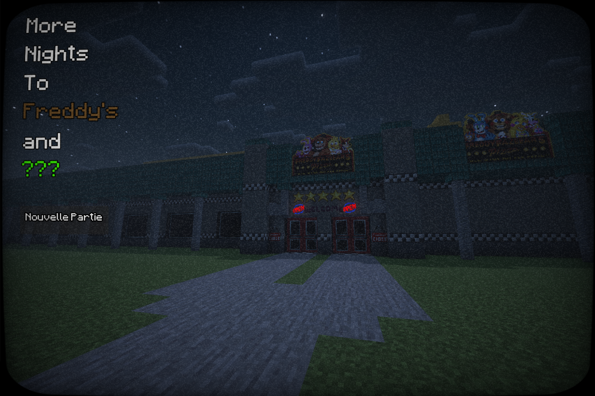
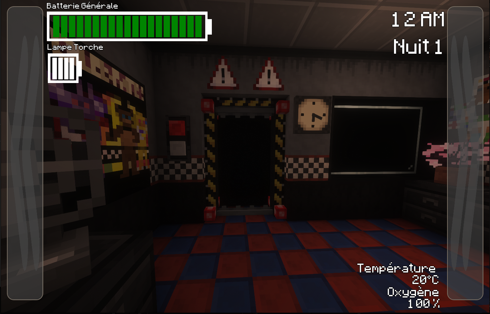
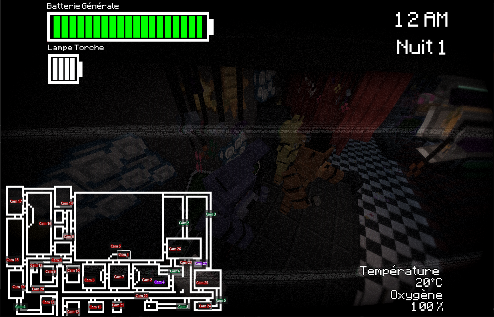
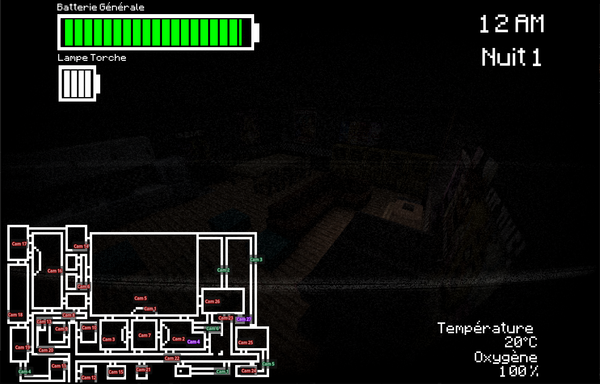

# More Nights to Freddy's

Un jeu de survie nocturne réalisé avec **Godot**, inspiré par l'univers de *Five Nights at Freddy's*.

Ce projet réalisé afin de m'entraîner à la programmation de jeux vidéo : organisation de scènes, interactions, interface, gestion des ressources, sons et logique de jeu.

> Ce projet de fan est non officiel et n'est pas affilié à Five Nights at Freddy's ni à ses ayants droit.

## Le jeu

Le joueur doit survivre à une nuit dans un bureau en surveillant les animatroniques et en gérant ses ressources. Il peut notamment :

- consulter les caméras de surveillance ;
- utiliser la lampe torche, le ventilateur ainsi que les portes du bureau ;
- surveiller la batterie et progresser au fil des nuits.

Les graphismes du jeu ont été produits à partir de captures d'écran prises dans **Minecraft**, puis intégrés et utilisés dans Godot.

## Captures d'écran

## Lancer le projet

1. Installer [Godot Engine](https://godotengine.org/).
2. Importer le fichier `project.godot` dans le gestionnaire de projets Godot.
3. Ouvrir le projet puis lancer la scène principale.

Le projet cible Godot `4.6` avec le moteur de rendu **Forward Plus**.

## Structure

- `Scenes/` : écran titre et scène du bureau.
- `Scripts/` : logique du jeu, caméras, batterie, portes, masque et ventilation.
- `Assets/` : images, polices et sons.
- `Components/` : composants réutilisables de l'interface.
- `Screenshots/` : aperçus du jeu.

## Credits

Visuel:
- **Minecraft** par Mojang Studio
- Le mod **FNaF Managment Wanted** par OVDR Studios
- Toute la **Structure** a été créé par moi-même

## Licence

Consultez le fichier [LICENSE](LICENSE) pour les conditions de licence du projet.